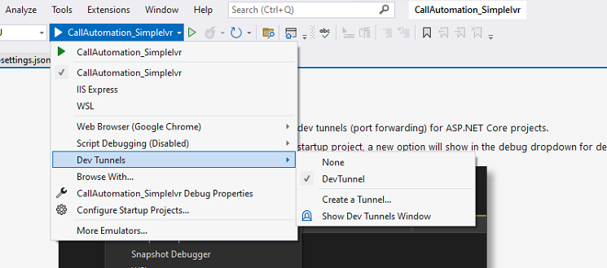

# Call Automation - Appointment Booking Sample

This sample application shows how the Azure Communication Services  - Call Automation SDK can be used to build appointment booking solutions.
The application accepts an incoming call when an callee dialed in to either ACS Communication Identifier or ACS acquired phone number.
Application start recording and prompt the Dual-Tone Multi-Frequency (DTMF) tones to select, and then plays the appropriate audio file based on the key pressed by the callee. 
The application has been configured to accept tone-1 through tone-3, and if any other key is pressed, the callee will hear an invalid tone prompt and retry.
Upon success the call will be disconnected. This sample has been developed as an app service application using .Net7 framework.

# Design

## Prerequisites

- Create an Azure account with an active subscription. For details, see [Create an account for free](https://azure.microsoft.com/free/)
- [Visual Studio (2022 v17.4.0 and above)](https://visualstudio.microsoft.com/vs/)
- [.NET7 Framework](https://dotnet.microsoft.com/en-us/download/dotnet/7.0) (Make sure to install version that corresponds with your visual studio instance, 32 vs 64 bit)
- Create an Azure Communication Services resource. For details, see [Create an Azure Communication Resource](https://docs.microsoft.com/azure/communication-services/quickstarts/create-communication-resource). You will need to record your resource **connection string** for this sample.
- Get a phone number for your new Azure Communication Services resource. For details, see [Get a phone number](https://learn.microsoft.com/en-us/azure/communication-services/quickstarts/telephony/get-phone-number?tabs=windows&pivots=programming-language-csharp)
- Enable Visual studio dev tunneling for local development. For details, see [Enable dev tunnel] (https://learn.microsoft.com/en-us/connectors/custom-connectors/port-tunneling)
	- To enable dev tunneling, Click `Tools` -> `Options` in Visual Studio 2022.  In the search bar type tunnel, Click the checkbox under `Environment` -> `Preview Features` called `Enable dev tunnels for Web Application`
	 
	- Create `Dev Tunnels`, for more details about [Dev Tunnels.](https://learn.microsoft.com/en-us/aspnet/core/test/dev-tunnels?view=aspnetcore-7.0)  
	   
	 

## Before running the sample for the first time

1. Open an instance of PowerShell, Windows Terminal, Command Prompt or equivalent and navigate to the directory that you would like to clone the sample to.
2. git clone `https://github.com/Azure-Samples/Communication-Services-dotnet-quickstarts.git`.

### Locally running the Call Automation Appointment Booking app
1. Go to CallAutomation_AppointmentBooking folder and open `CallAutomation_AppointmentBooking.sln` solution in Visual Studio.
2. Visual studio dev tunnel url - Run the solution once and check for dev tunnels being created, select to continue on security prompt.

### Publish the Call Automation Appointment Booking to Azure WebApp

1. Right click the `CallAutomation_AppointmentBooking` project and select Publish.
2. Create a new publish profile and select your app name, Azure subscription, resource group etc. (choose any unique name, as this URL needed for `BASE_URI` configuration settings)
3. After publishing, add the following configurations on azure portal (under app service's configuration section).

    - COMMUNICATION_CONNECTION_STRING: Azure Communication Service resource's connection string.
	- DIRECT_OFFERED_PHONE_NUMBER: Azure Communication Service acquired phone number.
	- BASE_URI: Url of the deployed app service.
	
### Create Webhook for Microsoft.Communication.IncomingCall event
IncomingCall is an Azure Event Grid event for notifying incoming calls to your Communication Services resource. To learn more about it, see [this guide](https://learn.microsoft.com/en-us/azure/communication-services/concepts/call-automation/incoming-call-notification). 
1. Navigate to your resource on Azure portal and select `Events` from the left side menu.
1. Select `+ Event Subscription` to create a new subscription. 
1. Filter for Incoming Call event. 
1. Choose endpoint type as web hook and provide the public url generated for your application by Dev Tunnels. Make sure to provide the exact api route that you programmed to receive the event previously. In this case, it would be <dev_tunnel_url>/api/incomingCall.  

	

1. Select create to start the creation of subscription and validation of your endpoint as mentioned previously. The subscription is ready when the provisioning status is marked as succeeded.

This subscription currently has no filters and hence all incoming calls will be sent to your application. To filter for specific phone number or a communication user, use the Filters tab.

4. Detailed instructions on publishing the app to Azure are available at [Publish a Web app](https://docs.microsoft.com/visualstudio/deployment/quickstart-deploy-to-azure?view=vs-2019).

**Note**: While you may use http://localhost for local testing, the sample when deployed will only work when served over https. The SDK [does not support http](https://docs.microsoft.com/azure/communication-services/concepts/voice-video-calling/calling-sdk-features#user-webrtc-over-https).

### Troubleshooting

1. Solution doesn't build, it throws errors during build

	Clean/rebuild the C# solution

## Resources
- [Call Automation Overview](https://learn.microsoft.com/azure/communication-services/concepts/voice-video-calling/call-automation)
- [Incoming Call Concept](https://learn.microsoft.com/azure/communication-services/concepts/voice-video-calling/incoming-call-notification)
- [Build a customer interaction workflow using Call Automation](https://learn.microsoft.com/azure/communication-services/quickstarts/voice-video-calling/callflows-for-customer-interactions?pivots=programming-language-csha)
- [Redirect inbound telephony calls with Call Automation](https://learn.microsoft.com/azure/communication-services/how-tos/call-automation-sdk/redirect-inbound-telephony-calls?pivots=programming-language-csharp)
- [Quickstart: Play action](https://learn.microsoft.com/azure/communication-services/quickstarts/voice-video-calling/play-action?pivots=programming-language-csharp)
- [Quickstart: Recognize action](https://learn.microsoft.com/azure/communication-services/quickstarts/voice-video-calling/recognize-action?pivots=programming-language-csharp)
- [Read more about Call Recording in Azure Communication Services](https://learn.microsoft.com/azure/communication-services/concepts/voice-video-calling/call-recording)
- [Record and download calls with Event Grid](https://learn.microsoft.com/azure/communication-services/quickstarts/voice-video-calling/get-started-call-recording?pivots=programming-language-csharp)