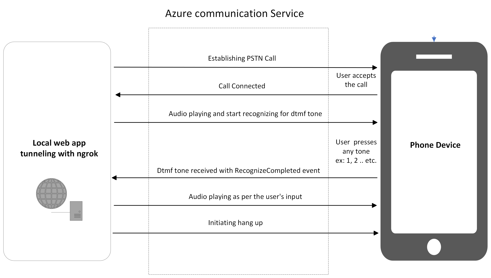

---
page_type: sample
languages:
- csharp
products:
- azure
- azure-communication-services
---

# Call Automation - Appointment Reminder Sample

This sample application shows how the Azure Communication Services  - Call Automation SDK can be used to build IVR related solutions. This sample makes an outbound call to a phone number performs dtmf recognition and the application plays next audio based on the key pressed by the callee. This sample application configured for accepting tone 1 (tone1), 2 (tone2) , If the callee pressed any other key than expected, an invalid audio tone will be played and then call will be disconnected.
This sample application is also capable of making multiple concurrent outbound calls. The application is a web-based application built on .Net6 framework.

# Design

## Prerequisites

- Create an Azure account with an active subscription. For details, see [Create an account for free](https://azure.microsoft.com/free/)
- [Visual Studio (2022 v17.4.0 and above)](https://visualstudio.microsoft.com/vs/)
- [.NET6 Framework](https://dotnet.microsoft.com/en-us/download/dotnet/6.0) (Make sure to install version that corresponds with your visual studio instance, 32 vs 64 bit)
- Create an Azure Communication Services resource. For details, see [Create an Azure Communication Resource](https://docs.microsoft.com/azure/communication-services/quickstarts/create-communication-resource). You will need to record your resource **connection string** for this sample.
- Get a phone number for your new Azure Communication Services resource. For details, see [Get a phone number](https://learn.microsoft.com/en-us/azure/communication-services/quickstarts/telephony/get-phone-number?tabs=windows&pivots=programming-language-csharp)
- Enable Visual studio dev tunneling for local development. For details, see [Enable dev tunnel] (https://learn.microsoft.com/en-us/connectors/custom-connectors/port-tunneling)
## Before running the sample for the first time

1. Open an instance of PowerShell, Windows Terminal, Command Prompt or equivalent and navigate to the directory that you would like to clone the sample to.
2. git clone `https://github.com/Azure-Samples/Communication-Services-dotnet-quickstarts.git`.
3. Navigate to `CallAutomation_AppointmentReminder` folder and open `CallAutomation_AppointmentReminder.sln` file.

### Configuring application

- Open the appsetting.json file to configure the following settings

	- `ConnectionString`: Azure Communication Service resource's connection string.
	- `SourcePhone`: Phone number associated with the Azure Communication Service resource. For e.g. "+1425XXXAAAA"
	- `TargetPhoneNumber`: Target phone number to add in the call. For e.g. "+1425XXXAAAA"
    - `AppBaseUri`: Base url of the app. (For local devlopment replace the dev tunnel url)

### How to run it locally
	- Run the `CallAutomation_AppointmentReminder` project in debug mode
	- Browser should pop up with swagger UI
	- To initiate the call, from the swagger ui execute the `/api/call` endpoint or make a Http post request to `https://<AppBaseUri>/api/call`
