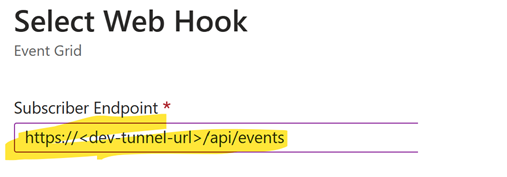

|page_type|languages|products
|---|---|---|
|sample|<table><tr><td>csharp</tr></td></table>|<table><tr><td>azure</td><td>azure-communication-services</td></tr></table>|

# Call Automation - Quick Start

In this quickstart, we cover how you can use BringYourOwnStorage feature in the Call Automation SDK for the call recording. .

# Design


## Prerequisites

- Create an Azure account with an active subscription. For details, see [Create an account for free](https://azure.microsoft.com/free/)
- Create an Azure Communication Services resource. For details, see [Create an Azure Communication Resource](https://docs.microsoft.com/azure/communication-services/quickstarts/create-communication-resource). You will need to record your resource **connection string** for this sample.
- Get a phone number for your new Azure Communication Services resource. For details, see [Get a phone number](https://learn.microsoft.com/en-us/azure/communication-services/quickstarts/telephony/get-phone-number?tabs=windows&pivots=programming-language-csharp)
- Create the your own azure storage container url
- Create and host a Azure Dev Tunnel. Instructions [here](https://learn.microsoft.com/en-us/azure/developer/dev-tunnels/get-started)
- [.NET7 Framework](https://dotnet.microsoft.com/en-us/download/dotnet/7.0) (Make sure to install version that corresponds with your visual studio instance, 32 vs 64 bit)

## Before running the sample for the first time

1. Open an instance of PowerShell, Windows Terminal, Command Prompt or equivalent and navigate to the directory that you would like to clone the sample to.
2. git clone `https://github.com/Azure-Samples/Communication-Services-dotnet-quickstarts.git`.
3. Navigate to `CallAutomation_CallRecording_Byos` folder and open `CallAutomation_CallRecording_Byos.sln` file.

### Setup and host your Azure DevTunnel

[Azure DevTunnels](https://learn.microsoft.com/en-us/azure/developer/dev-tunnels/overview) is an Azure service that enables you to share local web services hosted on the internet. Use the commands below to connect your local development environment to the public internet. This creates a tunnel with a persistent endpoint URL and which allows anonymous access. We will then use this endpoint to notify your application of calling events from the ACS Call Automation service.

```bash
devtunnel create --allow-anonymous
devtunnel port create -p 8080
devtunnel host
```
### Configuring application

Open the Program.cs file to configure the following settings

1. `acsConnectionString`: Azure Communication Service resource's connection string.
2. `callbackUriHost`: Base url of the app. (For local development replace the dev tunnel url)
3. `bringYouOwnStorageUrl`: Providethe created/owned azure storage container url

### Setting up azure event grid for ACS  events

1. Azure DevTunnel: Ensure your AzureDevTunnel URI is active and points to the correct port of your localhost application
2. Run `dotnet run` to build and run the incoming-call-recording tool
3. Register an EventGrid Webhook for the IncomingCall Event that points to your DevTunnel URI. Instructions [here](https://learn.microsoft.com/en-us/azure/communication-services/concepts/call-automation/incoming-call-notification).
   
   - **Step 1** -> Go to your communication service resource in the Azure portal
   - **Step 2** -> Left corner you might see the events and click event subsription on the right
     
     

   - **Step 3** -> Give the Name under the Subscription Details, and provide the system topic name under Topic Details and select **"Incoming Call" & "Recording File Status Updated"** under Event Types, And select the "Web Hook" from the Endpoint Details section
     
   

   - **Step 4** -> Click on Configure an endpoint, provide Subscriber Endpoint to your devtunnel url, and for the events endpoint. ex. **https://<devtunnelurl>/api/events**. And click on the Confirm Selection and Create
     
    

   - **Step 5** -> once its created you will be able to see under the events section of the communication service
   - 
    


### Run app locally

1. Run the `CallAutomation_CallRecording_Byos` project with `dotnet run`
2. Open `http://localhost:8080/swagger/index.html` or your dev tunnel url in browser
3. To initiate the call, from the your phone dial the acs phone number inorder to receive the incoming call`
