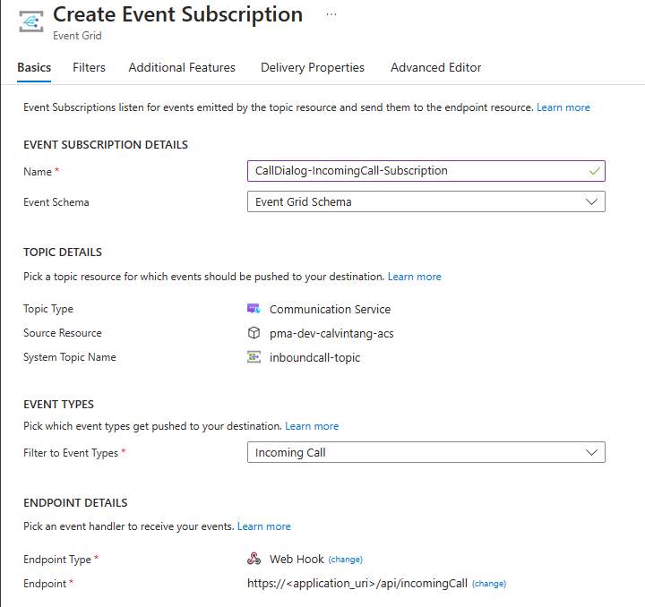

# Call Automation - Dialog Sample

The purpose of this sample application is to demonstrate the addition of a Dialog Bot App to a call leveraging the Call Automation SDK and the Interactive Voice Response capabilities. The application accepts an incoming call when a callee dials in to either ACS Communication Identifier or ACS acquired phone number and adds the Dialog Bot App to thecall. It also demonstrates the handling of the events related to the Dialog capabilities. This sample has been developed as an app service application using .NET6.

## Prerequisites

- Create an Azure account with an active subscription. For details, see [Create an account for free](https://azure.microsoft.com/free/)
- [Visual Studio (2022 and above)](https://visualstudio.microsoft.com/vs/)
- [.NET7](https://dotnet.microsoft.com/en-us/download/dotnet/7.0) (Make sure to install version that corresponds with your visual studio instance, 32 vs 64 bit)
- Create an Azure Communication Services resource. For details, see [Create an Azure Communication Resource](https://docs.microsoft.com/azure/communication-services/quickstarts/create-communication-resource). You'll need to record your resource **connection string** for this sample.
- Under the Communication Service resource, get a phone number within the `Phone numbers` tab.
- Create a [Nuance Mix][Nuance_Mix] bot

## Before running the sample for the first time

1. Open an instance of PowerShell, Windows Terminal, Command Prompt or equivalent and navigate to the directory that you'd like to clone the sample to.
2. Run `git clone https://github.com/Azure-Samples/Communication-Services-dotnet-quickstarts.git`
3. Within `appsettings.json`, add the phone number from the prerequisites and match it with the ID of the Dialog Bot App

### Publish the Call Automation Dialog to Azure WebApp

1. Right click the `CallAutomation_Dialog` project and select Publish.
2. Create a new publish profile and select your app name, Azure subscription, resource group etc. (choose any unique name, as this URL needed for `BaseUri` configuration settings)
3. After publishing, add the following configurations on azure portal (under app service's configuration section).

    - `CallConfiguration:ConnectionString`: Azure Communication Service resource's connection string.
    - `BaseUri`: Uri of your sample app

### Create Webhook for Microsoft.Communication.IncomingCall event
IncomingCall is an Azure Event Grid event for notifying incoming calls to your Communication Services resource. To learn more about it, see [this guide](https://learn.microsoft.com/en-us/azure/communication-services/concepts/call-automation/incoming-call-notification). 
1. Navigate to your resource on Azure portal and select `Events` from the left side menu.
1. Select `+ Event Subscription` to create a new subscription. 
1. Filter for Incoming Call event. 
1. Choose endpoint type as web hook and provide the URL of this application. Make sure to provide the exact api route that you programmed to receive the event previously. In this case, it would be `https://<application_uri>/api/incomingCall`.  

	

1. Select create to start the creation of subscription and validation of your endpoint as mentioned previously. The subscription is ready when the provisioning status is marked as succeeded.

This subscription currently has no filters and hence all incoming calls will be sent to your application. To filter for specific phone number or a communication user, use the Filters tab.

- Detailed instructions on publishing the app to Azure are available at [Publish a Web app](https://docs.microsoft.com/visualstudio/deployment/quickstart-deploy-to-azure?view=vs-2019).

**Note**: The sample when deployed will only work when served over https. The SDK [does not support http](https://docs.microsoft.com/azure/communication-services/concepts/voice-video-calling/calling-sdk-features#user-webrtc-over-https).

### Troubleshooting

1. Solution doesn't build, it throws errors during build

	Clean/rebuild the C# solution

<!-- Links -->
[Nuance_Mix]: https://docs.nuance.com/mix/