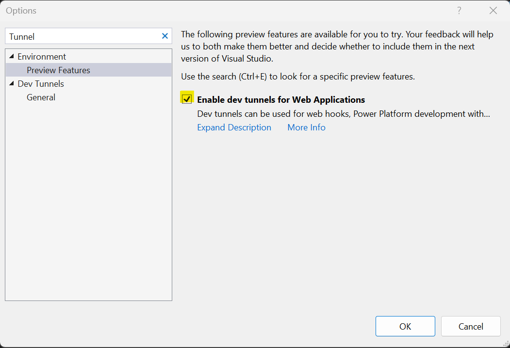
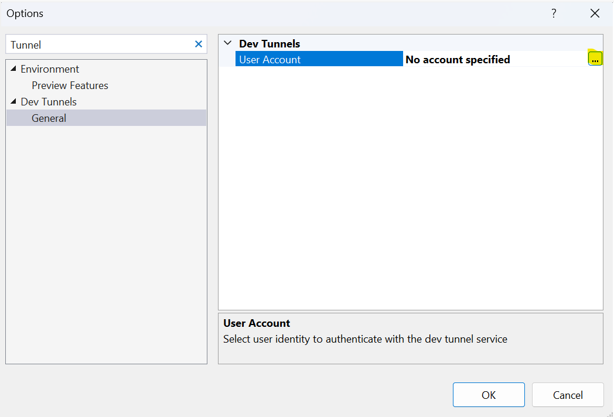

# Incoming call Media Streaming Sample

Get started with audio media streaming, through Azure Communication Services Call Automation SDK.  
This QuickStart assumes you’ve already used the calling automation APIs to build an automated call routing solution, please refer [Call Automation IVR Sample](https://github.com/Azure-Samples/communication-services-dotnet-quickstarts/tree/main/CallAutomation_SimpleIvr).

In this sample a WebApp receives an incoming call request whenever a call is made to a Communication Service acquired phone number or a communication identifier.  
API first answers the call with Media Streaming options settings. Once call connected, external PSTN user say something.  
The audio is streamed to WebSocket server and generates log events to show media streaming is happening on the server.
It supports Audio streaming only (mixed/unmixed format).

This sample has 3 parts:

1. ACS Resource IncomingCall Hook Settings, and ACS acquired Phone Number.
2. IncomingCall WebApp - for accepting the incoming call with Media Options settings.
3. WebSocketListener – Listen to media stream on websocket.

The application is an app service application built on .NET6.0.

## Prerequisites

- Create an Azure account with an active subscription. For details, see [Create an account for free](https://azure.microsoft.com/free/)
- [Visual Studio (2022 and above)](https://visualstudio.microsoft.com/vs/)
- [.NET6](https://dotnet.microsoft.com/en-us/download/dotnet-framework/net48) (Make sure to install version that corresponds with your visual studio instance, 32 vs 64 bit)
- Create an Azure Communication Services resource. For details, see [Create an Azure Communication Resource](https://docs.microsoft.com/azure/communication-services/quickstarts/create-communication-resource). You'll need to record your resource **connection string** for this sample.
- [Configuring the webhook](https://learn.microsoft.com/en-us/azure/communication-services/quickstarts/call-automation/callflows-for-customer-interactions?pivots=programming-language-csharp#subscribe-to-incomingcall-event) for **Microsoft.Communication.IncomingCall** event.
- Enable Visual studio dev tunneling for local development. For details, see [Enable dev tunnel] (https://learn.microsoft.com/en-us/connectors/custom-connectors/port-tunneling)
	- To enable dev tunneling, Click `Tools` -> `Options` in Visual Studio 2022
	- In the search bar type tunnel, Click the checkbox under `Environment` -> `Preview Features` called `Enable dev tunnels for Web Application`
	
	- Login into your account under `Dev Tunnels` -> `General`  
	

## Before running the sample for the first time

1. Open an instance of PowerShell, Windows Terminal, Command Prompt or equivalent and navigate to the directory that you'd like to clone the sample to.
2. git clone https://github.com/Azure-Samples/Communication-Services-dotnet-quickstarts.git.

### Locally running the media streaming WebSocket app

1. Go to CallAutomation_MediaStreaming folder and open `IncomingCallMediaStreaming.sln` solution in Visual Studio.
2. Select and run the `WebSocketListener` project, an application for listening media stream on websocket.
3. Used the dev tunnel to get public URL for `WebSocketListener` app, as this websocket URL needed for `MediaStreamingTransportURI` configuration.

### Publish  the Incoming call media streaming to Azure WebApp

1. Right click the `IncomingCallMediaStreaming` project and select Publish.
2. Create a new publish profile and select your app name, Azure subscription, resource group etc. (choose any unique name, as this URL needed for `AppCallBackUri` configuration settings)
3. After publishing, add the following configurations on azure portal (under app service's configuration section).

	- ResourceConnectionString: Azure Communication Service resource's connection string.
	- AppCallBackUri: URI of the deployed app service.
	- SecretValue: Query string for callback URL.
	- MediaStreamingTransportURI: websocket URL got from `WebSocketListener`, format "wss://{dev-tunnel-url}",(Notice the url, it should wss:// and not https://)

### Create Webhook for Incoming Call Event

IncomingCall is an Azure Event Grid event for notifying incoming calls to your Communication Services resource. To learn more about it, see [this guide](https://learn.microsoft.com/en-us/azure/communication-services/concepts/call-automation/incoming-call-notification).  

1. Navigate to your resource on Azure portal and select `Events` from the left side menu.
2. Select `+ Event Subscription` to create a new subscription.
3. Filter for Incoming Call event.
4. Choose endpoint type as web hook and provide the public URL generated for your websocket listener application by dev-tunnels. Make sure to provide the exact api route that you programmed to receive the event. In this sample, it would be <dev-tunnel-url>/api/incomingCall.  

5. Select create to start the creation of subscription and validation of your endpoint, the subscription is ready when the provisioning status marked as succeeded.

6. Detailed instructions on publishing the app to Azure are available at [Publish a Web app](https://docs.microsoft.com/visualstudio/deployment/quickstart-deploy-to-azure?view=vs-2019).

**Note**: While you may use http://localhost for local testing, the sample when deployed will only work when served over https. The SDK [does not support http](https://docs.microsoft.com/azure/communication-services/concepts/voice-video-calling/calling-sdk-features#user-webrtc-over-https).

### Troubleshooting

- Solution doesn't build, it throws errors during build
  - Clean/rebuild the C# solution
