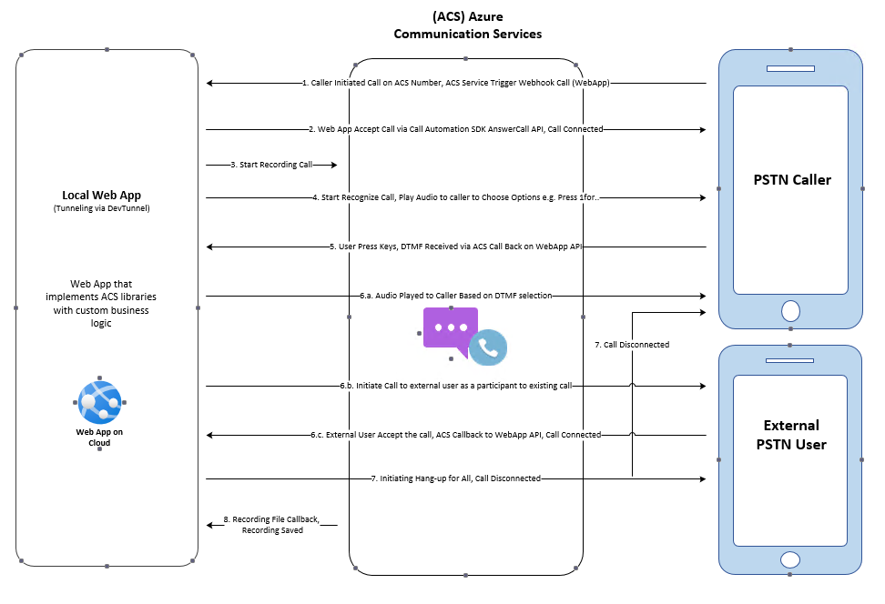
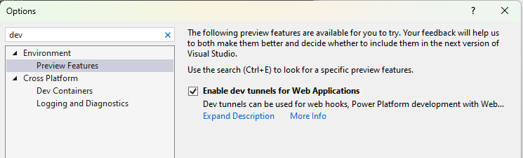
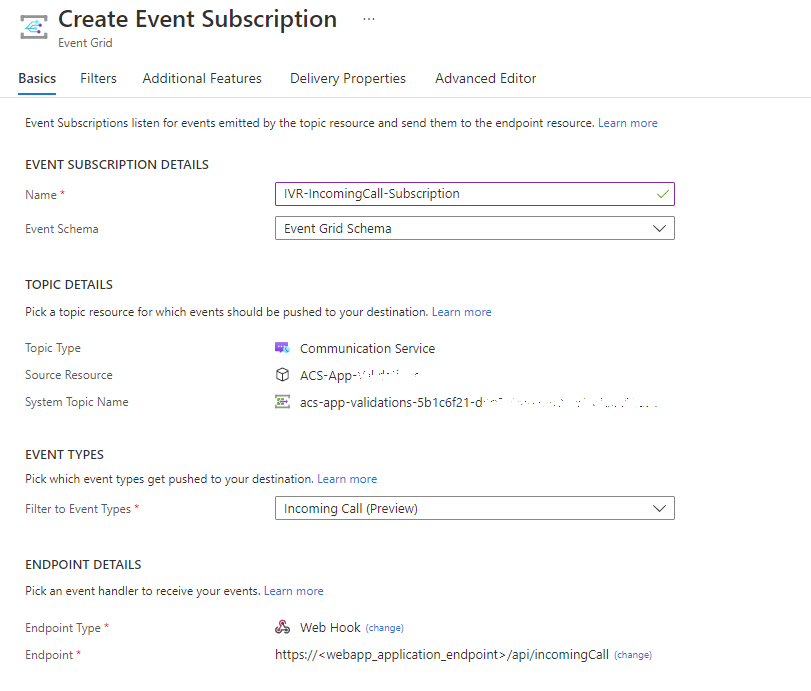

# Call Automation - Simple IVR Solution

This sample application shows how the Azure Communication Services - Call Automation SDK can be used to build IVR related solutions.  
This sample makes an outbound call to a phone number performs dtmf recognition and the application plays next audio based on the key pressed by the callee.
This sample application configured for accepting tone-1  through tone-5 , If the callee pressed any other key than expected, an invalid audio tone will be played and then call will be disconnected.
The application is an app service application built on .NET6.0.

# Design

## Prerequisites

- Create an Azure account with an active subscription. For details, see [Create an account for free](https://azure.microsoft.com/free/)
- [Visual Studio (2022 and above)](https://visualstudio.microsoft.com/vs/)
- [.NET6](https://dotnet.microsoft.com/en-us/download/dotnet-framework/net48) (Make sure to install version that corresponds with your visual studio instance, 32 vs 64 bit)
- Create an Azure Communication Services resource. For details, see [Create an Azure Communication Resource](https://docs.microsoft.com/azure/communication-services/quickstarts/create-communication-resource). You'll need to record your resource **connection string** for this sample.
- [Configuring the webhook](https://docs.microsoft.com/en-us/azure/devops/service-hooks/services/webhooks?view=azure-devops) for **Microsoft.Communication.IncomingCall** event.
- Enable Visual studio dev tunneling for local development. For details, see [Enable dev tunnel] (https://learn.microsoft.com/en-us/connectors/custom-connectors/port-tunneling)
	- To enable dev tunneling, Click `Tools` -> `Options` in Visual Studio 2022
	- In the search bar type tunnel, Click the checkbox under `Environment` -> `Preview Features` called `Enable dev tunnels for Web Application`
	-  
	- Login into your account under `Dev Tunnels` -> `General`
	-  

## Before running the sample for the first time

1. Open an instance of PowerShell, Windows Terminal, Command Prompt or equivalent and navigate to the directory that you'd like to clone the sample to.
2. git clone https://github.com/Azure-Samples/Communication-Services-dotnet-quickstarts.git.

### Locally running the Call Automation Simple IVR app
1. Go to CallAutomation_SimpleIvr folder and open `CallAutomation_SimpleIvr.sln` solution in Visual Studio.
2. Use the visual studio dev tunnel url to set the `CallbackUriBase` uri in the `appsettings.json` file

### Publish the Call Automation Simple IVR to Azure WebApp

1. Right click the `CallAutomation_SimpleIvr` project and select Publish.
2. Create a new publish profile and select your app name, Azure subscription, resource group etc. (choose any unique name, as this URL needed for `CallbackUriBase` configuration settings)
3. After publishing, add the following configurations on azure portal (under app service's configuration section).

	- ResourceConnectionString: Azure Communication Service resource's connection string.
	- ACSAlternatePhoneNumber: Azure Communication Service acquired phone number.
	- CallbackUriBase: URI of the deployed app service or Visual studio dev tunnel url.
	- ParticipantToAdd: Target phone number to add as participant.
	
### Create Webhook for Microsoft.Communication.IncomingCall event and Microsoft.Communication.RecordingFileStatusUpdated event
IncomingCall is an Azure Event Grid event for notifying incoming calls to your Communication Services resource. To learn more about it, see [this guide](https://learn.microsoft.com/en-us/azure/communication-services/concepts/call-automation/incoming-call-notification). 
1. Navigate to your resource on Azure portal and select `Events` from the left side menu.
1. Select `+ Event Subscription` to create a new subscription. 
1. Filter for Incoming Call event. 
1. Choose endpoint type as web hook and provide the public url generated for your application by ngrok. Make sure to provide the exact api route that you programmed to receive the event previously. In this case, it would be <ngrok_url>/api/incomingCall.  

	

1. Select create to start the creation of subscription and validation of your endpoint as mentioned previously. The subscription is ready when the provisioning status is marked as succeeded.

1. Follow the Above steps to create Webhook for RecordingFileStatusUpdated event.

This subscription currently has no filters and hence all incoming calls will be sent to your application. To filter for specific phone number or a communication user, use the Filters tab.

4. Detailed instructions on publishing the app to Azure are available at [Publish a Web app](https://docs.microsoft.com/visualstudio/deployment/quickstart-deploy-to-azure?view=vs-2019).

**Note**: While you may use http://localhost for local testing, the sample when deployed will only work when served over https. The SDK [does not support http](https://docs.microsoft.com/azure/communication-services/concepts/voice-video-calling/calling-sdk-features#user-webrtc-over-https).

### Troubleshooting

1. Solution doesn't build, it throws errors during build

	Clean/rebuild the C# solution
