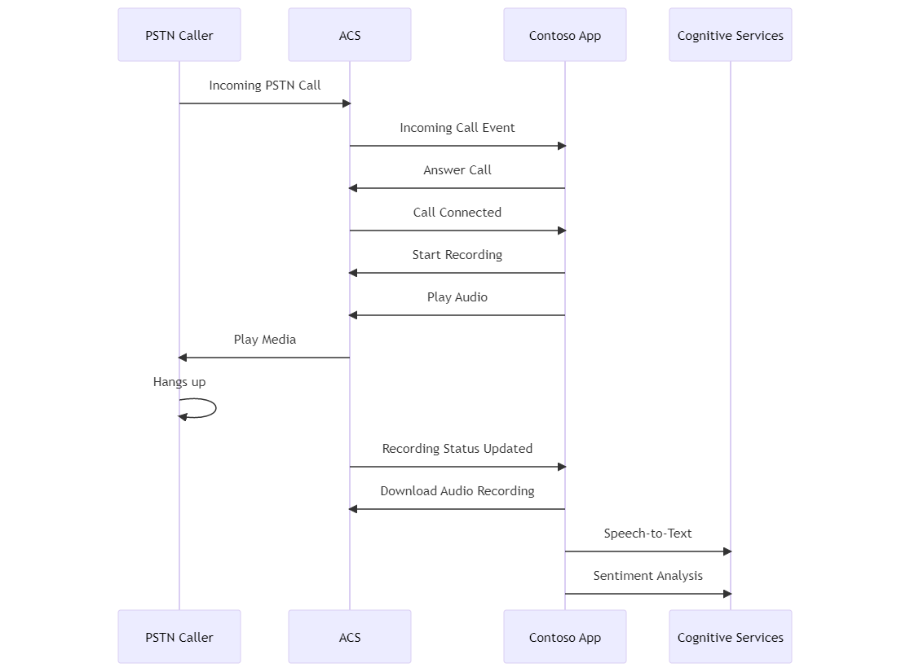

|page_type|languages|products
|---|---|---|
|sample|<table><tr><td>csharp</tr></td></table>|<table><tr><td>azure</td><td>azure-communication-services</td><td>azure-cognitive-services</td></tr></table>|

# Unmixed Audio Recording - Sentiment Analysis Sample

## Overview
This sample demonstrates a sample end-to-end flow using Azure Communication Services Call Automation SDK 
to answer an incoming call, start recording the unmixed audio, split the channels into separate file
and perform some basic sentiment analysis on the result using Azure Cognitive Services.

## Flow

## Prerequisites
- Create an Azure account with an active subscription. For details, see [Create an account for free](https://azure.microsoft.com/free/)
- [Visual Studio (2022 and above)](https://visualstudio.microsoft.com/vs/)
- [.NET 7](https://dotnet.microsoft.com/en-us/download/dotnet/7.0)
- Create an Azure Communication Services resource. For details, see [Create an Azure Communication Resource](https://docs.microsoft.com/azure/communication-
- [Azure Cognitive Services resource](https://azure.microsoft.com/en-us/products/cognitive-services/)
- [Azure Speech resource](https://azure.microsoft.com/en-us/products/cognitive-services/speech-services/)
- [Ngrok](https://ngrok.com/download)
- [FFMPeg](https://ffmpeg.org/download.html)

## Before running the sample for the first time
1. Open an instance of PowerShell, Windows Terminal, Command Prompt or equivalent and navigate to the directory that you'd like to clone the sample to.
2. git clone https://github.com/williamzhao87/Communication-Services-dotnet-quickstarts.git.

## How to run locally
1. Go to CallAutomation_UnmixedSentimentAnalysis folder and open `CallAutomation_UnmixedSentimentAnalysis.sln` solution in Visual Studio.
2. Start a local web tunnel using ngrok (or Visual Studio dev tunnels), e.g. `ngrok http 5000`
3. Replace the following strings with your own values:
  - ACS_CONNECTION_STRING your ACS connection string
  - NGROK_URI your ngrok Uri to expose
  - WELCOME_WAV_FILE_URI an audio wav file to play when call is connected
  - COGNITIVE_SERVICE_URI endpoint uri of your cognitive services
  - COGNITIVE_SERVICE_KEY secret of your cognitive services
  - SPEECH_KEY key of your speech services
  - SPEECH_REGION region of your speech services
4. Start your service
5. Setup the following [Event Grid subscriptions](https://learn.microsoft.com/en-us/azure/event-grid/event-schema-communication-services) for your ACS resource in the Azure Portal
  - Incoming Call with Webhook Uri `<NGROK_URI>/api/incomingCall`
  - Recording File Status Updated with Webhook Uri `<NGROK_URI>/api/recordingDone`
6. Run the following ffmpeg commands:
  - Find number of channels: `ffprobe -v error -show_entries stream=channels,channel_layout -of default=nw=1 unmixed_recording.wav`
  - Split into 2 mono files: `ffmpeg -i unmixed_recording.wav -filter_complex "[0:a]channelsplit=channel_layout=stereo[left][right]" -map "[left]" channel0.wav -map "[right]" channel1.wav`
7. Get the sentiment analysis by opening following URI in a browser: https://localhost:5001/api/sentimentAnalysis?filePath=channel0.wav