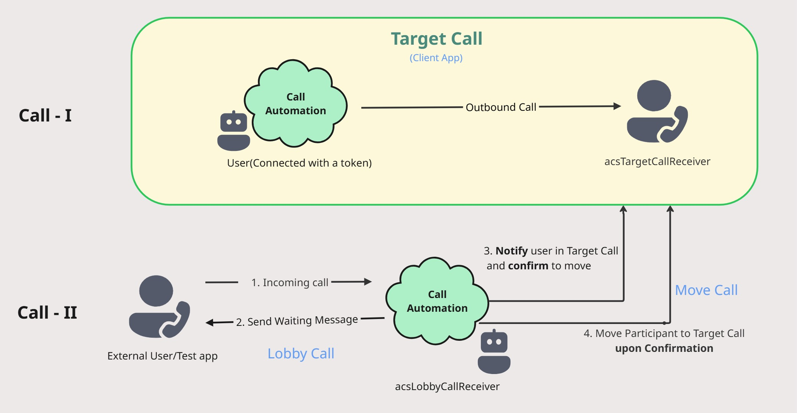

| page_type | languages                               | products                                                                    |
| --------- | --------------------------------------- | --------------------------------------------------------------------------- |
| sample    | <table><tr><td>DotNet</td><td>Java Script</td></tr></table> | <table><tr><td>azure</td><td>azure-communication-services</td></tr></table> |

# Call Automation - Lobby Call Support Sample

This sample demonstrates how to utilize the Call Automation SDK to implement a Lobby Callscenario. In this setup, users initially join a lobby call (Call - I)  and remain on hold until an user in the target call (Call - II)  confirms their participation. Once approved, the bot automatically moves the lobby user to the target call.

# Design




## Prerequisites
- A [phone number](https://learn.microsoft.com/en-us/azure/communication-services/quickstarts/telephony/get-phone-number) in your Azure Communication Services resource that can make outbound calls. NB: phone numbers are not available in free subscriptions.
- Create Azure AI Multi Service resource. For details, see [Create an Azure AI Multi service](https://learn.microsoft.com/en-us/azure/cognitive-services/cognitive-services-apis-create-account).
- Create and host a Azure Dev Tunnel. Instructions [here](https://learn.microsoft.com/en-us/azure/developer/dev-tunnels/get-started)
- A Client application that can make calls to the Azure Communication Services resource. This can be a web client or a mobile client. You can use the [Web Client Quickstart](https://github.com/Azure-Samples/communication-services-javascript-quickstarts/tree/users/v-kuppu/LobbyCallConfirmSample)

## Before running the sample for the first time

1. Open the web client app at [JS Client Sample](https://github.com/Azure-Samples/communication-services-javascript-quickstarts/tree/users/v-kuppu/LobbyCallConfirmSample) and sign in with your Azure Communication Services identity.
2. Clone the sample repository by running `git clone https://github.com/Azure-Samples/communication-services-javascript-quickstarts.git`.
3. Run the application and observe logs at console, keep this application running.

    ```
    npx webpack serve --config webpack.config.js
    ```
4. UI of client application will be available at `http://localhost:<port-number>/` and will look like below.


5. Generate an Azure Communication Services identity for the lobby call receiver and target call receiver. You can do this from the Azure Portal(ACS Resource -> Identities & User Access Tokens -> Generate Identity and USER ACCESS TOKEN).
### Setup and host your Azure DevTunnel

[Azure DevTunnels](https://learn.microsoft.com/en-us/azure/developer/dev-tunnels/overview) is an Azure service that enables you to share local web services hosted on the internet. Use the commands below to connect your local development environment to the public internet. This creates a tunnel with a persistent endpoint URL and which allows anonymous access. We will then use this endpoint to notify your application of calling events from the ACS Call Automation service.

### Configuring application

Open `appSettings.json` file to configure the following settings

1. `acsConnectionString`: Azure Communication Service resource's connection string.
2. `cognitiveServiceEndpoint`: Cognitive Service resource's endpoint.
   - This is used to play media to the participants in the call.
   - For more information, see [Create an Azure AI Multi service](https://learn.microsoft.com/en-us/azure/cognitive-services/cognitive-services-apis-create-account).
3. `callbackUriHost`: Base url of the app. (For local development use dev tunnel url)
4. `acsGeneratedIdForLobbyCallReceiver`: ACS Inbound Phone Number
5. `acsGeneratedIdForTargetCallReceiver`: ACS Phone Number to make the first call, external user number in real time
6. `acsGeneratedIdForTargetCallSender`: ACS identity generated using web client

## Run app locally

1. Generate an Azure Communication Services identity for the lobby call receiver and target call receiver. You can do this from the Azure Portal(ACS Resource ? Identities & User Access Tokens ? Generate Identity and USER ACCESS TOKEN).
2.  Setup EventSubscription(Incoming) with filter for `TO.DATA.RAWID = <ACS_GENERATED_ID_TARGET_CALL_RECEIVER>, <ACS_GENERATED_ID_LOBBY_CALL_RECEIVER>`.
3. Setup webhook for Incoming calls to point to `https://<your_dev_tunnel_url>/callbacks/incomingcall` in EventSubscription(Incoming).
4. Setup the following keys in the config/constants
	 ```
	 "acsConnectionString": "<acsConnectionString>",
	 "cognitiveServiceEndpoint": "<cognitiveServiceEndpoint>",
	 "callbackUriHost": "<callbackUriHost>",
	 "acsGeneratedIdForLobbyCallReceiver": "<acsGeneratedIdForLobbyCallReceiver>",(Generate Voice Calling Identity in Azure Portal)
	 "acsGeneratedIdForTargetCallReceiver": "<acsGeneratedIdForTargetCallReceiver>",(Generate Voice Calling Identity in Azure Portal)
	 "acsGeneratedIdForTargetCallSender": "<acsGeneratedIdForTargetCallSender>",(Generate Voice Calling Identity in Azure Portal)```
4. Define a websocket with url as "/ws" in your application(program.cs) to send and receive messages from and to the client application.
5. Define a Client application(JS Hero App in this case) that receives and responds to server notifications. Client application is available at <url>.
  Start the target call in Client application, 
    - Add token of target call sender(token would be generated in Azure user & tokens section).
	- Add user id of the target call receiver `<ACS_GENERATED_ID_FOR_LOBBY_CALL_RECEIVER>`.
	- Click on `Start Call` button to initiate the call.
6. Expect Call Connected event in /callbacks.
7. Call will be answered by the server app and automated voice will be played to lobby user with the text `You are currently in a lobby call, we will notify the admin that you are waiting.`
8. Once the play is completed, Target call will be notified with `A user is waiting in lobby, do you want to add the lobby user to your call?`.
9. Once the Target call confirms from client application, Move `ACS_GENERATED_ID_FOR_LOBBY_CALL_RECEIVER` in the backend sample.
10. If Target user says no, then no MOVE will be performed.
11. Ensure MoveParticipantSucceeded event is received in `/callbacks` endpoint.
12. Ensure the output in the logs shows the the additional lobby user in the target call. The number of participants in the target call are increased by adding the lobby user, then lobby call gets disconnected after the moving the lobbyy user(as lobby user is already moved into the target call).