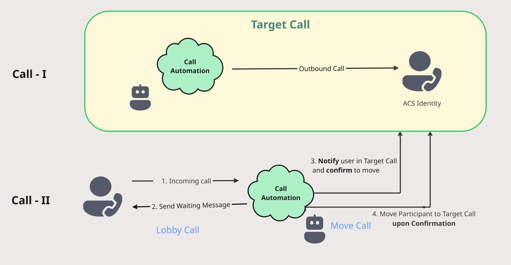

| page_type | languages                               | products                                                                    |
| --------- | --------------------------------------- | --------------------------------------------------------------------------- |
| sample    | <table><tr><td>DotNet</tr></td></table> | <table><tr><td>azure</td><td>azure-communication-services</td></tr></table> |

# Call Automation - Lobby Call Support Sample

In this sample, we cover how you can use Call Automation SDK to support Lobby Call where we join Lobby call users to a target call upon confirmation of admin in the target call.

# Design




## Prerequisites

- An Azure account with an active subscription. [Create an account for free](https://azure.microsoft.com/free/?WT.mc_id=A261C142F).
- A deployed Communication Services resource. [Create a Communication Services resource](https://docs.microsoft.com/azure/communication-services/quickstarts/create-communication-resource).
- A [phone number](https://learn.microsoft.com/en-us/azure/communication-services/quickstarts/telephony/get-phone-number) in your Azure Communication Services resource that can make outbound calls. NB: phone numbers are not available in free subscriptions.
- Create Azure AI Multi Service resource. For details, see [Create an Azure AI Multi service](https://learn.microsoft.com/en-us/azure/cognitive-services/cognitive-services-apis-create-account).
- Create and host a Azure Dev Tunnel. Instructions [here](https://learn.microsoft.com/en-us/azure/developer/dev-tunnels/get-started)
- A Client application that can make calls to the Azure Communication Services resource. This can be a web client or a mobile client. You can use the [Web Client Quickstart](https://github.com/Azure-Samples/communication-services-javascript-quickstarts/tree/users/v-kuppu/LobbyCallConfirmSample)

## Before running the sample for the first time

1. Open the web client app at [JS Client Sample](https://github.com/Azure-Samples/communication-services-javascript-quickstarts/tree/users/v-kuppu/LobbyCallConfirmSample) and sign in with your Azure Communication Services identity.
2. Clone the sample repository by running `git clone https://github.com/Azure-Samples/communication-services-javascript-quickstarts.git`.
3. Run the application and observe logs at console, keep this application running.

    ```
    npx webpack serve --config webpack.config.js
    ```

### Setup and host your Azure DevTunnel

[Azure DevTunnels](https://learn.microsoft.com/en-us/azure/developer/dev-tunnels/overview) is an Azure service that enables you to share local web services hosted on the internet. Use the commands below to connect your local development environment to the public internet. This creates a tunnel with a persistent endpoint URL and which allows anonymous access. We will then use this endpoint to notify your application of calling events from the ACS Call Automation service.

### Configuring application

Open `appSettings.json` file to configure the following settings

1. `acsConnectionString`: Azure Communication Service resource's connection string.
2. `cognitiveServiceEndpoint`: Cognitive Service resource's endpoint.
   - This is used to play media to the participants in the call.
   - For more information, see [Create an Azure AI Multi service](https://learn.microsoft.com/en-us/azure/cognitive-services/cognitive-services-apis-create-account).
3. `callbackUriHost`: Base url of the app. (For local development use dev tunnel url)
4. `confirmMessageToTargetCall`: Notification message to be played to the target call participants when they are moved from lobby call to target call.
   - This is used to notify the target call participants that they are being moved from lobby call to target call.
   - For more information, see [Play media in a call](https://learn.microsoft.com/en-us/azure/communication-services/concepts/calls/play-media).
5. `textToPlayToLobbyUser`: Text to be played to the lobby call user when they are waiting in the lobby.
   - This is used to notify the lobby call user that they are waiting in the lobby.
   - For more information, see [Play media in a call](https://learn.microsoft.com/en-us/azure/communication-services/concepts/calls/play-media).
6. `acsGeneratedIdForLobbyCallReceiver`: ACS Inbound Phone Number
7. `acsGeneratedIdForTargetCallReceiver`: ACS Phone Number to make the first call, external user number in real time
8. `acsGeneratedIdForTargetCallSender`: ACS identity generated using web client
9. `socketToken`: ACS identity generated using web client

## Run app locally

1. Setup EventSubscription(Incoming) with filter for `TO.DATA.RAWID = <ACS_GENERATED_ID_TARGET_CALL_RECEIVER>, <ACS_GENERATED_ID_LOBBY_CALL_RECEIVER>`.
2. Setup the following keys in the config/constants
	 ```"acsConnectionString": "<acsConnectionString>",
	 "cognitiveServiceEndpoint": "<cognitiveServiceEndpoint>",
	 "callbackUriHost": "<callbackUriHost>",
	 "textToPlayToLobbyUser": "You are currently in a lobby call, we will notify the admin that you are waiting.",
	 "confirmMessageToTargetCall": "A user is waiting in lobby, do you want to add the lobby user to your call?",
	 "acsGeneratedIdForLobbyCallReceiver": "<acsGeneratedIdForLobbyCallReceiver>",(Generate Voice Calling Identity in Azure Portal)
	 "acsGeneratedIdForTargetCallReceiver": "<acsGeneratedIdForTargetCallReceiver>",(Generate Voice Calling Identity in Azure Portal)
	 "acsGeneratedIdForTargetCallSender": "<acsGeneratedIdForTargetCallSender>",(Generate Voice Calling Identity in Azure Portal)
	 "socketToken": "<socketToken>"(Token associated with <acsGeneratedIdForTargetCallSender> in Azure Portal)```
3. Define a websocket in your application(program.cs) to send and receive messages from and to client application(JS Hero App in this case).
4. Define a Client application that receives and responds to server notifications. Client application is available at <url>.
5. Enter and validate user token in client app to send calls.
6. Start call to `<acsGeneratedIdForTargetCallReceiver>`.
7. Expect Call Connected evennt in /callbacks
8. Start a call from ACS Test app(angular) to acsGeneratedIdForLobbyCallReceiver
9. Call will be answered and automated voice will be played to lobby user with the text `<textToPlayToLobbyUser>`. 
10. Once the play completed, Target call will be notified with `<confirmMessageToTargetCall>`.
11. Once the Target call confirms from client application, Move `<acsGeneratedIdForLobbyCallReceiver>` in the backend sample.
12. If Target user says no, then no MOVE will be performed.
13. Ensure MoveParticipantSucceeded event is received in `/callbacks` endpoint.
14. Check `/Getparticipants` endpoint be called with Target call id, Target call must have the recent lobby user in the call.