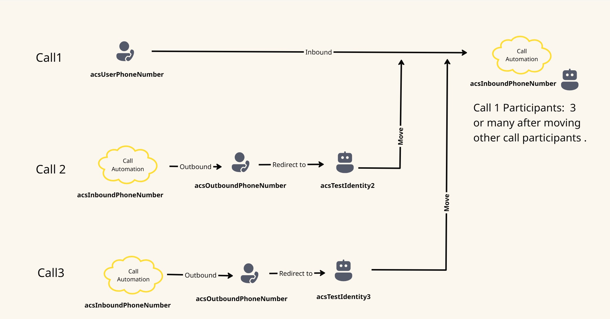

| page_type | languages                               | products                                                                    |
| --------- | --------------------------------------- | --------------------------------------------------------------------------- |
| Sample    | <table><tr><td>DotNet</td><td>C#</td></tr></table> | <table><tr><td>azure</td><td>azure-communication-services</td></tr></table> |

# Call Automation – Move Participants Sample

This sample demonstrates how to use the Call Automation SDK to implement a Move Participants Call scenario with Azure Communication Services.

---
## Table of Contents
- [Overview](#overview)
- [Design](#design)
- [Prerequisites](#prerequisites)
- [Getting Started](#getting-started)
- [Configuration](#configuration)
- [Running the App Locally](#running-the-app-locally)
- [Troubleshooting](#troubleshooting)

---

## Overview

This project provides a sample implementation for moving participants between calls using Azure Communication Services and the Call Automation SDK.

---

## Design



---

## Prerequisites

- **Azure Account:** An Azure account with an active subscription.  
  https://azure.microsoft.com/free/?WT.mc_id=A261C142F.
- **Communication Services Resource:** A deployed Communication Services resource.  
  https://docs.microsoft.com/azure/communication-services/quickstarts/create-communication-resource.
- **Phone Number:** A https://learn.microsoft.com/en-us/azure/communication-services/quickstarts/telephony/get-phone-number in your Azure Communication Services resource that can make outbound calls.
- **Azure Dev Tunnel:** https://learn.microsoft.com/en-us/azure/developer/dev-tunnels/get-started.

---

## Getting Started

### Clone the Source Code

1. Open PowerShell, Windows Terminal, Command Prompt, or equivalent.
2. Navigate to your desired directory.
3. Clone the repository:
   ```sh
   git clone https://github.com/Azure-Samples/communication-services-dotnet-quickstarts.git
4. Navigate to the `MoveParticipantsSample` folder and open the `MoveParticipantsSample.sln` file.

### Restore .NET Packages

In the `MoveParticipantsSample/MoveParticipantsSample` directory, run:
```sh
dotnet restore
```
---

## Setup and Host Azure Dev Tunnel

```
# Install Dev Tunnel CLI
dotnet tool install -g Microsoft.DevTunnels.Client

# Authenticate with Azure
devtunnel login

# Create and start a tunnel
devtunnel host -p 8080
```

---
## Configuration

Before running the application, configure the following settings in the `appSettings.json` file.

| Setting                  | Description                                                                                                    | Example Value                         |
|--------------------------|----------------------------------------------------------------------------------------------------------------|---------------------------------------|
| `acsConnectionString`    | The connection string for your Azure Communication Services resource. Find this in the Azure Portal under your resource’s “Keys” section. | `"endpoint=https://<RESOURCE>.communication.azure.com/;accesskey=<KEY>"` |
| `callbackUriHost`        | The base URL where your app will listen for incoming events from Azure Communication Services. For local development, use your Azure Dev Tunnel URL. | `"https://<your-dev-tunnel>.devtunnels.ms"` |
| `acsOutboundPhoneNumber` | The Azure Communication Services phone number used to make outbound calls. Must be purchased and configured in your ACS resource. | `"+1XXXXXXXXXX"`                      |
| `acsInboundPhoneNumber`  | The Azure Communication Services phone number used to receive inbound calls. Must also be configured in your ACS resource. | `"+1XXXXXXXXXX"`                      |
| `acsUserPhoneNumber`     | The phone number of the external user to initiate the first call. Any valid phone number for testing. | `"+1XXXXXXXXXX"`                      |
| `acsTestIdentity2`       | An Azure Communication Services user identity, generated using the ACS web client or SDK, used for testing participant movement. | `"8:acs:<GUID>"`                      |
| `acsTestIdentity3`       | Another ACS user identity, generated similarly, for additional test scenarios. | `"8:acs:<GUID>"`                      |

### How to Obtain These Values

- **acsConnectionString:**  
  1. Go to the Azure Portal.
  2. Navigate to your Communication Services resource.
  3. Select “Keys & Connection String.”
  4. Copy the “Connection String” value.

- **callbackUriHost:**  
  1. Set up an Azure Dev Tunnel as described in the prerequisites.
  2. Use the public URL provided by the Dev Tunnel as your callback URI host.

- **acsOutboundPhoneNumber / acsInboundPhoneNumber:**  
  1. In your Communication Services resource, go to “Phone numbers.”
  2. Purchase or use an existing phone number.
  3. Assign the number as needed for outbound/inbound use.

- **acsUserPhoneNumber:**  
  Use any valid phone number you have access to for testing outbound calls.

- **acsTestIdentity2 / acsTestIdentity3:**  
  1. Use the ACS web client or SDK to generate user identities.
  2. Store the generated identity strings here.

#### Example `appSettings.json`

```json
{
  "acsConnectionString": "endpoint=https://<RESOURCE>.communication.azure.com/;accesskey=<KEY>",
  "callbackUriHost": "https://<your-dev-tunnel>.devtunnels.ms",
  "acsOutboundPhoneNumber": "+1XXXXXXXXXX",
  "acsInboundPhoneNumber": "+1XXXXXXXXXX",
  "acsUserPhoneNumber": "+1XXXXXXXXXX",
  "acsTestIdentity2": "8:acs:<GUID>",
  "acsTestIdentity3": "8:acs:<GUID>"
}
```
---
## Running the App Locally

1. **Create an azure event grid subscription for incoming calls:**
   - Set up a Web hook(`https://<dev-tunnel-url>/api/MoveParticipantEvent`) for callback.
   - Add Filters:
     - Key: `data.From.PhoneNumber.Value`, operator: `string contains`, value: `acsUserPhoneNumber, Inbound Number (ACS)`
     - Key: `data.to.rawid`, operator: `string does not begin`, value: `8`
   - Deploy the event subscription.

2. **Run the Application:**
   - Navigate to the `MoveParticipantsSample` folder.
   - Run the application in debug mode.

3. **Workflow Execution**

> **Note:**  
> The phone numbers and identities referenced below are configured in `appsettings.json`:
> - `acsUserPhoneNumber`
> - `acsInboundPhoneNumber`
> - `acsOutboundPhoneNumber`
> - `acsTestIdentity2`
> - `acsTestIdentity3`
> The phone numbers are released and available when the call is answered as they are created in ACS resource in Azure.

#### Call 1

1. `acsUserPhoneNumber` calls `acsInboundPhoneNumber`. Note the Call connection Id as **Target Call Connection Id** when the call is created.
2. Call Automation answers the call and assigns a bot to the call as receiver.
3. `acsInboundPhoneNumber` is freed from the call after the call was answered and assigned to a bot.


#### Call 2

1. `acsInboundPhoneNumber` makes a call to `acsOutboundPhoneNumber`. Note the Call connection Id as **Source Call Connection Id** when the call is created.
2. Call Automation answers the call and redirects to `acsTestIdentity2`, then releases `acsOutboundPhoneNumber` from the call. The call connection id generated here is an internal connection id; do not consider this connection id during the Move operation.

Move Participant operation:
- Inputs:
  - Source Connection Id (from Call 2) to move the participant from.
  - Target Connection Id (from Call 1) to move the participant to.
  - Participant (initial participant before call is redirected) from Source call (Call 2): `acsOutboundPhoneNumber`
- **Participants list after `MoveParticipantSucceeded` event:** 3


#### Call 3

1. `acsInboundPhoneNumber` makes a call to `acsOutboundPhoneNumber`. Note the Call connection Id as **Source (to move) Call Connection Id** when the call is created.
2. Call Automation answers the call and redirects to `acsTestIdentity3`, then releases `acsOutboundPhoneNumber` from the call. The call connection id generated here is an internal connection id; do not consider this connection id during the Move operation.

Move Participant operation:
- Inputs:
  - Source Connection Id (from Call 3) to move the participant from.
  - Target Connection Id (from Call 1) to move the participant to.
  - Participant (initial participant before call is redirected) from Source call (Call 3): `acsOutboundPhoneNumber`
- **Participants list after `MoveParticipantSucceeded` event:** 4

---

## API Testing with Swagger

You can explore and test the available API endpoints using the built-in Swagger UI:

- **Swagger URL:**  
  [https://localhost:8080/swagger/index.html](https://localhost:8080/swagger/index.html)

> If running in a dev tunnel or cloud environment, replace `localhost:8080` with your tunnel's public URL (e.g., `https://<your-dev-tunnel>.devtunnels.ms/swagger/index.html`).

---

## Troubleshooting

If you encounter issues while setting up or running the Call Automation sample, refer to the following troubleshooting tips:

### 1. Azure Communication Services Connection Issues
- **Error:** "Invalid connection string"  
  **Solution:** Double-check your `acsConnectionString` in `appSettings.json`. Ensure there are no extra spaces or missing characters. Obtain the connection string directly from the Azure Portal.

- **Error:** "Resource not found"  
  **Solution:** Verify that your Azure Communication Services resource exists and is in the correct subscription and region.

### 2. Dev Tunnel or Callback Issues
- **Error:** "Callback URL not reachable" or events not triggering  
  **Solution:**  
  - Ensure your Azure Dev Tunnel is running and the URL in `callbackUriHost` matches the tunnel’s public URL.
  - Confirm your firewall or network settings allow inbound connections to your local machine.
  - Make sure the application is running and listening on the correct port.

### 3. Phone Number Problems
- **Error:** "Phone number not provisioned" or "Invalid phone number"  
  **Solution:**  
  - Confirm that the phone numbers in `acsOutboundPhoneNumber` and `acsInboundPhoneNumber` are purchased and assigned in your Azure Communication Services resource.
  - Use E.164 format (e.g., `+1XXXXXXXXXX`).

### 4. Identity or Participant Issues
- **Error:** "Invalid ACS identity"  
  **Solution:**  
  - Ensure `acsTestIdentity2` and `acsTestIdentity3` are valid ACS user identities generated via the ACS SDK or portal.
  - Regenerate identities if needed and update `appSettings.json`.

### 5. .NET or Dependency Issues
- **Error:** "Could not restore packages"  
  **Solution:**  
  - Run `dotnet restore` in the project directory.
  - Ensure you have the correct version of the .NET SDK installed (check the project’s `global.json` or documentation).

### 6. General Debugging Tips
- Check application logs for detailed error messages.
- Ensure all configuration settings are correct.
- Restart your application and Dev Tunnel after making configuration changes.
- Review Azure Portal for resource status and quotas.

**Still having trouble?**  
- Review the official https://learn.microsoft.com/azure/communication-services/.
- Search for similar issues or ask questions on https://learn.microsoft.com/answers/topics/azure-communication-services.html.
- Contact your Azure administrator or support team if you suspect a permissions or resource issue.