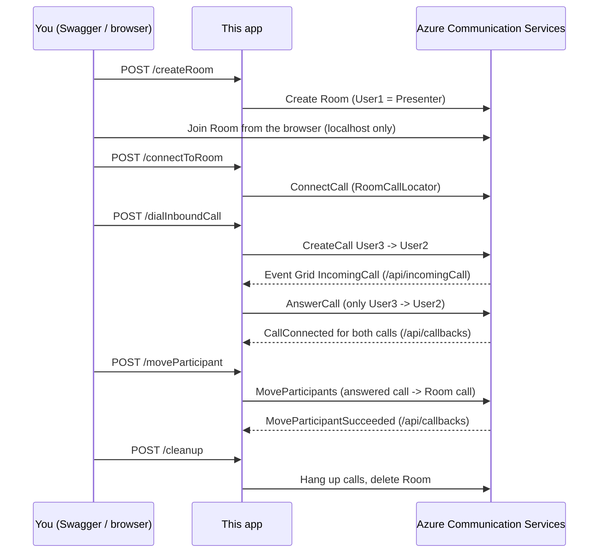

| page_type | languages                               | products                                                                    |
| --------- | --------------------------------------- | --------------------------------------------------------------------------- |
| Sample    | <table><tr><td>DotNet</td><td>C#</td></tr></table> | <table><tr><td>azure</td><td>azure-communication-services</td></tr></table> |

# Call Automation – Inbound PSTN to Rooms (MoveParticipant) Sample

This sample demonstrates how to bring an inbound PSTN caller into an Azure Communication Services Room using the Call Automation **MoveParticipants** API.

---
## Table of Contents
- [Overview](#overview)
- [Design](#design)
- [Endpoints](#endpoints)
- [Prerequisites](#prerequisites)
- [Getting Started](#getting-started)
- [Setup and Host Azure Dev Tunnel](#setup-and-host-azure-dev-tunnel)
- [Configuration](#configuration)
- [Code Structure](#code-structure)
- [Running the App Locally](#running-the-app-locally)
- [Troubleshooting](#troubleshooting)

---

## Overview

Like the other Call Automation quickstarts, this is an ASP.NET Core app that receives the `IncomingCall` Event Grid event and Call Automation callbacks on public webhook endpoints (exposed locally with an Azure Dev Tunnel). You drive the steps from Swagger.

The app creates a Room, joins it from a browser, places a test PSTN call, answers it, and then moves the PSTN caller from the answered call into the Room call.

---

## Design



Run the steps in order from Swagger (`/swagger`):

1. **`POST /createRoom`**: creates a Room with a single `Presenter` participant and PSTN dial-out enabled, and prepares the browser join page. The response contains the page address with a one-time `session` code.
2. **Join the Room**: a Room call only exists on the server once a live participant joins it with a Calling SDK client. Open `https://localhost:8080/roomJoinClient?session=<code>` in your browser (the token and Room Id are pre-filled), click **Join Room** and wait for **Connected**. The page and token are only served on `localhost`, never through the Dev Tunnel.
3. **`POST /connectToRoom`**: connects Call Automation to the Room call with `ConnectCallAsync` + `RoomCallLocator`.
4. **`POST /dialInboundCall`**: Call Automation dials from one ACS-acquired number (`User3`) to another (`User2`). This raises the `Microsoft.Communication.IncomingCall` event.
5. **Answer the call** (automatic): the Event Grid webhook `POST /api/incomingCall` receives the event, ignores calls that aren't from `User3` to `User2`, and answers with `AnswerCallAsync`.
6. **`POST /moveParticipant`**: calls `MoveParticipantsAsync` to move `User3` from the answered call into the Room call. The app tracks `CallConnected` events received on `POST /api/callbacks` and only allows the move once **both** calls are connected (otherwise the move fails with error `8501`). `MoveParticipantSucceeded` / `MoveParticipantFailed` are logged.
7. **`POST /cleanup`**: hangs up every call the app created (deleting a Room doesn't end its call) and deletes the Room.

---

## Endpoints

### Workflow endpoints (you call these, in order, from Swagger)

| Endpoint | What it does |
|---|---|
| `POST /createRoom` | Creates a 10-day Room with `User1` as `Presenter` and PSTN dial-out enabled, stores the Room id, issues a VoIP access token for `User1` and creates a one-time `session` code for it. Returns the Room id and the join-page address. The token itself is never returned. |
| `POST /connectToRoom` | Returns 409 if `/createRoom` hasn't been called. Otherwise calls `ConnectCallAsync` with a `RoomCallLocator` (this needs a participant to have already joined the Room from the browser) and stores the Room call connection id. Returns that id; the call becomes usable once `CallConnected` arrives on `/api/callbacks`. |
| `POST /dialInboundCall` | Calls `CreateCallAsync` to `User2` with `User3` as the caller ID, which must be an ACS-owned number. The call raises `IncomingCall`, which `/api/incomingCall` answers. Returns the outbound call connection id. |
| `POST /moveParticipant` | Returns 409 if the Room call isn't connected or the inbound call hasn't been answered, and 409 until `CallConnected` has been received for **both** calls. Then calls `MoveParticipantsAsync` to move `User3` from the answered call into the Room call. Returns the Azure error (for example `8522`) if it fails. The final result arrives on `/api/callbacks` and is logged. |
| `POST /cleanup` | Hangs up every call the app created or answered (the Room call, the outbound call and the answered call), ignoring calls that already ended, then deletes the Room and resets the session. Deleting a Room doesn't end its call, so the hang-up is required. |

### Webhook endpoints (Azure calls these)

| Endpoint | What it does |
|---|---|
| `POST /api/incomingCall` | Event Grid webhook for `Microsoft.Communication.IncomingCall`. Replies to the subscription validation event. For an incoming call, it answers only calls from `User3` to `User2` with `AnswerCallAsync` and ignores the rest, since the subscription covers the whole resource. Stores the answered call's connection id as the source call. |
| `POST /api/callbacks` | Call Automation callback. Records `CallConnected` and `CallDisconnected`, and logs `MoveParticipantSucceeded`, `MoveParticipantFailed`, `ConnectFailed` and `CreateCallFailed`. |

### Browser helper endpoints (`localhost` only, hidden from Swagger)

| Endpoint | What it does |
|---|---|
| `GET /roomJoinClient` | Serves `RoomJoinClient/index.html`. Returns 404 unless the request host is `localhost`, so the Dev Tunnel can't reach it. |
| `GET /session?id=<code>` | Exchanges the one-time `session` code for the access token and Room id. Works once. A wrong or reused code, or a non-`localhost` request, returns 404. |

---

## Prerequisites

- **Azure Account:** An Azure account with an active subscription.  
  https://azure.microsoft.com/free/?WT.mc_id=A261C142F.
- **Communication Services Resource:** A deployed Communication Services resource.  
  https://docs.microsoft.com/azure/communication-services/quickstarts/create-communication-resource.
- **Phone Numbers:** Two numbers in your Azure Communication Services resource: one with inbound calling enabled (`User2`, receives the call) and one with outbound calling enabled (`User3`, used as the caller ID).  
  https://learn.microsoft.com/azure/communication-services/quickstarts/telephony/get-phone-number
- **Communication User Identity:** An identity to join the Room as the presenter.  
  https://learn.microsoft.com/azure/communication-services/quickstarts/identity/quick-create-identity
- **.NET 10 SDK:** https://dotnet.microsoft.com/download/dotnet/10.0
- **Azure Dev Tunnel:** https://learn.microsoft.com/azure/developer/dev-tunnels/get-started. Visual Studio can create one for you (see [Setup and Host Azure Dev Tunnel](#setup-and-host-azure-dev-tunnel)).
- **Browser:** A current version of Microsoft Edge or Google Chrome, with microphone access allowed for `localhost`.

---

## Getting Started

### Clone the Source Code

1. Open PowerShell, Windows Terminal, Command Prompt, or equivalent.
2. Navigate to your desired directory.
3. Clone the repository:
   ```sh
   git clone https://github.com/Azure-Samples/communication-services-dotnet-quickstarts.git
   ```
4. Navigate to the `Rooms-Inbound-PSTN` folder and open the `RoomsInboundPSTN.sln` file.

### Restore .NET Packages

In the `Rooms-Inbound-PSTN` directory, run:
```sh
dotnet restore
```

---

## Setup and Host Azure Dev Tunnel

Azure needs a public address to send events to. Use either option below.

**Option A: from Visual Studio (recommended)**

1. Open `RoomsInboundPSTN.sln`.
2. In the debug toolbar, open the dropdown next to the green start button and choose **Dev Tunnels (no active tunnel)** > **Create a Tunnel...**
3. Sign in, give the tunnel a name, set **Tunnel Type** to **Persistent** (the URL stays the same between sessions) and **Access** to **Public** (Azure must reach it without signing in), then click **OK**.
4. Select the new tunnel in the same dropdown so it is active, then press F5. Visual Studio starts the app and forwards its port through the tunnel.
5. Copy the tunnel URL from the Output window (**Dev Tunnels**). It looks like `https://<id>-8080.<region>.devtunnels.ms`.

If the tunnel forwards a different port from the one in `Properties/launchSettings.json`, correct it under **Debug > Debug Properties > Dev Tunnels**.

**Option B: from the command line**

```
devtunnel create --allow-anonymous
devtunnel port create -p 8080
devtunnel host
```

Use the tunnel URL as `CallbackUriHost` below, with no trailing path.

---

## Configuration

Before running the application, configure the following settings in the `appsettings.json` file.

| Setting | Description | Example Value |
|---|---|---|
| `AcsConnectionString` | The connection string for your Azure Communication Services resource. | `"endpoint=https://<RESOURCE>.communication.azure.com/;accesskey=<KEY>"` |
| `CallbackUriHost` | The public base URL of this app. Call Automation sends callbacks to `<CallbackUriHost>/api/callbacks`. For local development, use your Azure Dev Tunnel URL. | `"https://<your-dev-tunnel>.devtunnels.ms"` |
| `User1` | A Communication User identity that joins the Room as the presenter from the browser client. | `"8:acs:<GUID>"` |
| `User2` | The ACS phone number that receives the call and raises `IncomingCall`. | `"+1XXXXXXXXXX"` |
| `User3` | A second ACS phone number the call is placed from (required as the outbound caller ID), and the participant that gets moved into the Room. | `"+1XXXXXXXXXX"` |

### How to Obtain These Values

- **AcsConnectionString:**
  1. Go to the Azure Portal.
  2. Navigate to your Communication Services resource.
  3. Select "Keys & Connection String."
  4. Copy the "Connection String" value.

- **CallbackUriHost:**
  1. Set up an Azure Dev Tunnel as described above.
  2. Use the public URL provided by the Dev Tunnel, with no trailing path.

- **User1:**
  1. Use the [quick-create identity](https://learn.microsoft.com/azure/communication-services/quickstarts/identity/quick-create-identity) page in the portal, or the Identity SDK, to create a user identity.
  2. Copy the identity string (`8:acs:...`).

- **User2 / User3:**
  1. In your Communication Services resource, go to "Phone numbers."
  2. Purchase or use two existing phone numbers.
  3. Make sure `User2` can receive calls (inbound) and `User3` can place calls (outbound).

#### Example `appsettings.json`

```json
{
  "AcsConnectionString": "endpoint=https://<RESOURCE>.communication.azure.com/;accesskey=<KEY>",
  "CallbackUriHost": "https://<your-dev-tunnel>.devtunnels.ms",
  "User1": "8:acs:<GUID>",
  "User2": "+1XXXXXXXXXX",
  "User3": "+1XXXXXXXXXX"
}
```

> **Important:** don't commit real connection strings or access keys. Keep real values out of source control (for example `git update-index --skip-worktree appsettings.json`) or use a secret store.

## Code Structure

- **Program.cs**: the ASP.NET Core minimal API: Event Grid and callback webhooks plus the workflow endpoints (room creation, connect, dial, move, cleanup).
- **RoomJoinClient/index.html**: a browser client that joins the Room using the ACS Calling SDK, loaded as ES modules from `esm.sh`. It logs the call state, the call end reason (`code`/`subCode`) and the `callId`. Verbose SDK logs are written to the browser console (F12).
- **appsettings.json**: connection string, callback host and the user identities/phone numbers.
- **RoomsInboundPSTN.csproj**: project file (.NET 10). It copies `RoomJoinClient/index.html` to the build output.
- **RoomsInboundPSTN.sln**: Visual Studio solution.

---

## Running the App Locally

1. **Create an Azure Event Grid subscription for incoming calls** (one-time):
   - In the Azure portal, open your Communication Services resource and go to **Events**.
   - Add an event subscription for the **Incoming Call** event only.
   - Set the endpoint type to **Web Hook** and the address to `<CallbackUriHost>/api/incomingCall`.
   - Azure sends a validation event that the app answers automatically, so the app must be running (with the tunnel active) when you save the subscription.
   - If your tunnel address changes, update the subscription.

2. **Run the application:**
   - Press F5 in Visual Studio (with the Dev Tunnel selected), or run `dotnet run` from this folder with the tunnel hosted separately.
   - Swagger opens at `https://localhost:8080/swagger`.

3. **Run the workflow** from Swagger, in order, as described under [Design](#design): `/createRoom`, open the join page and click **Join Room**, `/connectToRoom`, `/dialInboundCall`, `/moveParticipant`, `/cleanup`.

---

## Troubleshooting

### 1. Azure Communication Services Connection Issues
- Verify `AcsConnectionString` in `appsettings.json` is correct and the resource is active.
- `/moveParticipant` or `/connectToRoom` returns an Azure error: the log shows the Azure status and error code.

### 2. Dev Tunnel or Callback Issues
- Ensure the Dev Tunnel is running, set to **Public** access, and forwards the app's port (8080).
- `CallbackUriHost` changes every run: a temporary tunnel was used. Create a persistent Dev Tunnel, or update `CallbackUriHost` and the Event Grid subscription each time.
- The incoming call is never answered: check the Event Grid subscription points at `<CallbackUriHost>/api/incomingCall`, the Dev Tunnel is running, and `User3`/`User2` match the numbers actually used.

### 3. Phone Number Problems
- `User3` must be an ACS-acquired number, because the outbound caller ID must belong to your resource.
- `User2` must have inbound calling enabled, and `User3` outbound calling.

### 4. Browser Join Client Issues
- `Cannot destructure property 'CallClient' of 'window.AzureCommunicationCalling'`: an old version of the page that used `<script src>` tags. Use the current `index.html`, which imports the SDK as ES modules.
- Join Room button does nothing: script error or blocked CDN. Check the browser console (F12) and confirm `esm.sh` is reachable.
- The join page fields are empty: the one-time `session` code was already used or the app restarted. Call `/createRoom` again, and open the page on `localhost`, not through the Dev Tunnel.
- Browser call ends with `code=500, subCode=5701`: a failure on the Azure side or in your network. Check the verbose logs in the F12 console, try another network or VPN setting, and give the logged `callId` to Azure support.

### 5. Move Participant Errors
- `/moveParticipant` returns 409: the Room call or the inbound call isn't connected yet. Check the logs for `CallConnected` events and retry.
- `8501` Action is invalid when call is not in Established state: a call isn't fully established yet. Wait for both `CallConnected` events and retry.
- `8522` Call not found: the Room call or the source call has ended.

### 6. General Debugging Tips
- Check the app's console logs for the events received on `/api/incomingCall` and `/api/callbacks`.
- Use Swagger to re-run individual steps, and call `/cleanup` to start over.