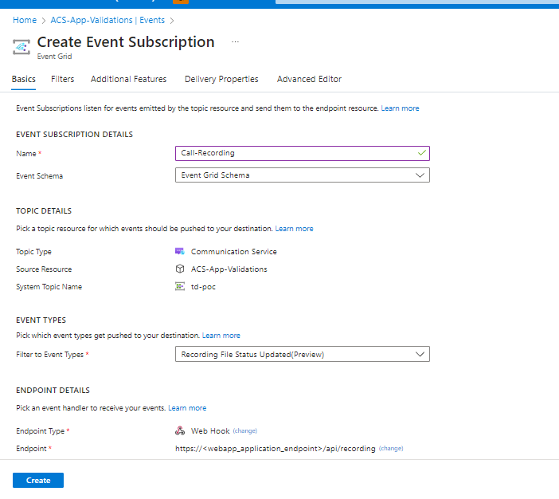

# Recording APIs Sample
This is a sample application to show how the Azure Communication Services Call Automation SDK can be used to build a call recording feature.
It's a C# based application powered by Dot net core to connect this application with Azure Communication Services.
A separate branch with end to end implementation is [available](https://github.com/Azure-Samples/communication-services-web-calling-hero/tree/public-preview). It's a public preview branch and uses beta SDKs that are not meant for production use. Please use the main branch sample for any production scenarios.
## Prerequisites
- Create an Azure account with an active subscription. For details, see [Create an account for free](https://azure.microsoft.com/free/?WT.mc_id=A261C142F)
- [Visual Studio (2019 and above)](https://visualstudio.microsoft.com/vs/)
- [.NET Core 6.0](https://dotnet.microsoft.com/en-us/download/dotnet/6.0) (Make sure to install the version that corresponds with your visual studio instance, 32 vs 64 bit)
- Create an Azure Communication Services resource. For details, see [Create an Azure Communication Resource](https://docs.microsoft.com/azure/communication-services/quickstarts/create-communication-resource). You'll need to record your resource **connection string** for this quickstart.
- An Azure storage account and container, for details, see [Create a storage account](https://docs.microsoft.com/azure/storage/common/storage-account-create?tabs=azure-portal). You'll need to record your storage **connection string** and **container name** for this quickstart.

 ### Create Webhook for Microsoft.Communication.RecordingFileStatus event
Call Recording enables you to record multiple calling scenarios available in Azure Communication Services by providing you with a set of APIs to start, stop, pause and resume recording. To learn more about it, see [Create Webhook](https://learn.microsoft.com/en-us/azure/event-grid/handler-webhooks#webhooks). 
1. Navigate to your resource on Azure portal and select `Events` from the left side menu.
2. Select `+ Event Subscription` to create a new subscription. 
3. Filter for Recording File Status event. 
4. Choose endpoint type as web hook and provide the public url generated for your application by Dev Tunnels. Make sure to provide the exact api route that you programmed to receive the event previously. In this case, it would be <dev_tunnel_url>/api/recording.

1. Select create to start the creation of subscription and validation of your endpoint as mentioned previously. The subscription is ready when the provisioning status is marked as succeeded.
2. Detailed instructions on publishing the app to Azure are available at [Publish a Web app](https://docs.microsoft.com/visualstudio/deployment/quickstart-deploy-to-azure?view=vs-2019).

## Code structure

- ./ServerRecording/Controllers : Server app core logic for calling recording APIs using Azure Communication Services server calling SDK
- ./ServerRecording/Program.cs : Entry point for the server app program logic
- ./ServerRecording/Startup.cs : Entry point for the server app startup logic
## Before running the sample for the first time

1. Open an instance of PowerShell, Windows Terminal, Command Prompt or equivalent and navigate to the directory that you'd like to clone the sample to.
2. git clone https://github.com/Azure-Samples/Communication-Services-dotnet-quickstarts.git.
3. Once you get the config keys add the keys to the **ServerRecording/appsetting.json**  file found under the ServerRecording folder.
	- Input your ACS connection string in the variable: `ACSResourceConnectionString`
	- Input your storage connection string in the variable: `BlobStorageConnectionString`
	- Input blob container name for recorded media in the variable `BlobContainerName`

## Locally deploying the sample app

1. Go to ServerRecording folder and open `RecordingApi.csproj` solution in Visual Studio
2. Run `RecordingApi` project.
3. Use postman or any debugging tool and open url - https://localhost:5001