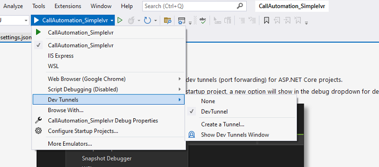

# Recording APIs Sample

This is a sample application to showcase how the Call Automation SDK can be used to add recording features to any application.

This application, built on the .NET Core framework using C#, is seamlessly integrated with Azure Communication Services. It harnesses the power of Azure Communication Services to establish connections and enable communication features within the application.

A separate branch with end to end implementation is [available](https://github.com/Azure-Samples/communication-services-web-calling-hero/tree/public-preview). It's a public preview branch and uses beta SDKs that are not meant for production use. Please use the main branch sample for any production scenarios.

## Prerequisites
- Create an Azure account with an active subscription. For details, see [Create an account for free](https://azure.microsoft.com/free/)
- [Visual Studio (2022 and above)](https://visualstudio.microsoft.com/vs/)
- [.NET7](https://dotnet.microsoft.com/en-us/download/dotnet/7.0) (Make sure to install version that corresponds with your visual studio instance, 32 vs 64 bit)
- Create an Azure Communication Services resource. For details, see [Create an Azure Communication Resource](https://docs.microsoft.com/azure/communication-services/quickstarts/create-communication-resource). You'll need to record your resource **connection string** for this sample.
- Enable Visual studio dev tunneling for local development. For details, see   [Enable dev tunnel] (https://learn.microsoft.com/en-us/connectors/custom-connectors/port-tunneling)
	
	- To enable dev tunneling, Click `Tools` -> `Options` in Visual Studio 2022.  In the search bar type tunnel, Click the checkbox under `Environment` -> `Preview Features` called `Enable dev tunnels for Web Application`
	 
	- Create `Dev Tunnels`, for more details about [Dev Tunnels.](https://learn.microsoft.com/en-us/aspnet/core/test/dev-tunnels?view=aspnetcore-7.0)  
	 
	- For accessing the Dev Tunnel public change the Access to Public.  
	 

## Clone the code local and update appsettings

1. Open an instance of PowerShell, Windows Terminal, Command Prompt or equivalent and navigate to the directory that you'd like to clone the sample to.
2. Run `git clone https://github.com/Azure-Samples/Communication-Services-dotnet-quickstarts.git`
3. Once you get the code on local machine, navigate to **ServerRecording/appsettings.json** file found under the ServerRecording folder.
4. Update the values for below.

	| Key | Value | Description |
	| -------- | -------- | -------- |
	| `ACSResourceConnectionString`    | \<ACS Connection String>   | Input your ACS connection string in the variable   |
	| `ACSAcquiredPhoneNumber`    | \<ACS Acquired Number>   | Phone number associated with the Azure Communication Service resource   |
	| `BaseUri`    | \<dev tunnel url>   | Base url of the app, don't add `/` at end. For getting the dev tunnel url, run the app once.   |

## Code structure

- `./ServerRecording/Controllers/RecordingsController.cs`: Exposing Recordings APIs as well as helper APIs to start the recording.
- `./ServerRecording/Program.cs`: Entry point for the server app, and startup settings.
- `./ServerRecording/Models.cs`: Models for recording types, format etc.

## Locally Run the sample app

1. Go to ServerRecording folder and open `RecordingApi.csproj` solution in Visual Studio.
2. Enable Visual studio dev tunneling for local development (see pre-requisite section for enabling dev tunnel).
3. Run the application in debug mode, swagger url should open, if swagger not opened by itself add `/swagger/index.html` at the end.

## Create Webhook for Microsoft.Communication.RecordingFileStatus event
Call Recording enables you to record multiple calling scenarios available in Azure Communication Services by providing you with a set of APIs to start, stop, pause and resume recording. To learn more about it, see [this guide](https://learn.microsoft.com/en-us/azure/communication-services/concepts/voice-video-calling/call-recording). 
1. Navigate to your resource on Azure portal and select `Events` from the left side menu.
2. Select `+ Event Subscription` to create a new subscription. 
3. Filter for Recording File Status Updated(preview) event. 
4. Choose endpoint type as web hook and provide the public url generated for your application by Dev Tunnels. Make sure to provide the exact api route that you programmed to receive the event previously. In this case, it would be <dev_tunnel_url>/recording/getRecordingFile.  
  
5. Select create to start the creation of subscription and validation of your endpoint as mentioned previously. The subscription is ready when the provisioning status is marked as succeeded.  
**Note:** Application should be running to able to create the webhook successfully. 

## Step by step to test recordings API via swagger.

Once App is running local, you will see all list of exposed API on swagger.
1. Step 1. Start a call invoke api/call under Outbound section.
	- Try it out `GET api/outbound_call`, provide the Target PSTN phone number to get the call.
	- Execute, accept the call on Target PSTN Phone number, Keep call running.

2. Step 2. Start Recording.
	-	Get the serverCallId from log (command prompt should be running while you open the App in debug mode).
	-	Try it out `POST recordings`, provide the serverCallId value.
	- 	Execute, recording would be started.
3. Step 3. (Optional) Execute `POST recordings/{recordingId}:pause` and then `POST recordings/{recordingId}:resume`.

4. Step 4. Execute `DELETE recordings/{recordingId}` for stop the recording.

5. Step 5. After stop recording, there would be callbacks for download recording file, check on App running folder to see the recording files.

## Troubleshooting

1. Solution doesn\'t build, it throws errors during build.
	- Clean/rebuild the C# solution.
2. Recording files not getting downloaded.
	- Check for webhook settings if dev tunnel url is correct.

## Additional Reading

- [Azure Communication Calling SDK](https://docs.microsoft.com/azure/communication-services/concepts/voice-video-calling/calling-sdk-features) - To learn more about the calling web SDK.
- [ASP.NET Core](https://learn.microsoft.com/en-us/aspnet/core/introduction-to-aspnet-core?view=aspnetcore-7.0) - Framework for building web applications

